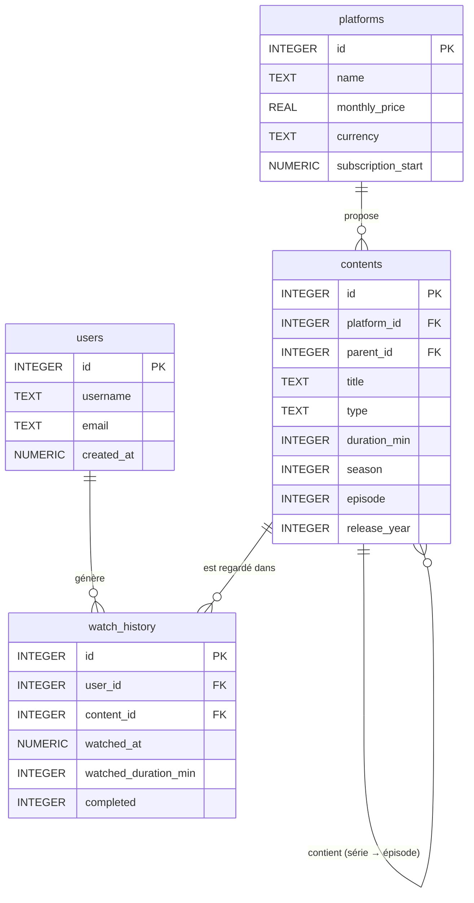

# DESIGN.md — StreamTrack

## 1. Entités et relations

### Vue d'ensemble

StreamTrack s'articule autour de **4 tables principales** qui modélisent la réalité du streaming :

| Table | Rôle |
|---|---|
| `platforms` | Les plateformes d'abonnement (Netflix, Disney+…) |
| `users` | Les membres du foyer qui regardent du contenu |
| `contents` | Le catalogue de films et séries (avec leurs épisodes) |
| `watch_history` | Chaque session de visionnage (qui, quoi, combien de temps) |

### Relations

- Une plateforme propose **plusieurs contenus** → relation one-to-many entre `platforms` et `contents`
- Un contenu peut être **un film ou un épisode de série** → gestion dans `contents` avec une auto-référence (`parent_id`) pour rattacher un épisode à sa série
- Un utilisateur peut regarder **plusieurs contenus** → relation many-to-many gérée par `watch_history`
- Chaque entrée de `watch_history` lie **un utilisateur** à **un contenu** sur **une plateforme**

---

## 2. Diagramme Entité-Relation

---

## 3. Description détaillée des tables

### `platforms`

Stocke les plateformes auxquelles l'utilisateur est abonné.

| Colonne | Type | Contraintes | Justification |
|---|---|---|---|
| `id` | `INTEGER` | `PRIMARY KEY` | Identifiant auto-incrémenté |
| `name` | `TEXT` | `NOT NULL UNIQUE` | Pas deux fois la même plateforme |
| `monthly_price` | `REAL` | `NOT NULL`, `CHECK > 0` | Prix en euros avec centimes (ex: 15.99). `REAL` et non `INTEGER` car les tarifs ont des décimales. |
| `currency` | `TEXT` | `NOT NULL DEFAULT 'EUR'` | Devise, `'EUR'` par défaut |
| `subscription_start` | `NUMERIC` | `NOT NULL` | Date de début d'abonnement. `NUMERIC` car SQLite n'a pas de type `DATE` dédié — il stocke les dates comme texte ou entier selon le format. |

---

### `users`

Les personnes du foyer qui partagent le compte.

| Colonne | Type | Contraintes | Justification |
|---|---|---|---|
| `id` | `INTEGER` | `PRIMARY KEY` | Identifiant auto-incrémenté |
| `username` | `TEXT` | `NOT NULL UNIQUE` | Pseudo unique par profil |
| `email` | `TEXT` | `UNIQUE` | Peut être NULL (profil enfant sans email) |
| `created_at` | `NUMERIC` | `NOT NULL DEFAULT CURRENT_TIMESTAMP` | Horodatage de création du profil |

---

### `contents`

Le catalogue de tout ce qui peut être regardé : films **et** épisodes de séries.

> **Choix de conception clé** : films et épisodes sont dans la **même table**. Un épisode est un contenu dont le champ `parent_id` pointe vers sa série (elle-même un contenu de type `'serie'`). Cela évite une table séparée pour les épisodes et simplifie les jointures.

| Colonne | Type | Contraintes | Justification |
|---|---|---|---|
| `id` | `INTEGER` | `PRIMARY KEY` | Identifiant auto-incrémenté |
| `platform_id` | `INTEGER` | `NOT NULL`, `FOREIGN KEY` | Chaque contenu appartient à une plateforme |
| `parent_id` | `INTEGER` | `FOREIGN KEY`, nullable | Pointe vers la série parente si c'est un épisode. NULL pour les films et les séries elles-mêmes. |
| `title` | `TEXT` | `NOT NULL` | Titre du film, de la série ou de l'épisode |
| `type` | `TEXT` | `NOT NULL`, `CHECK IN ('movie', 'series', 'episode')` | Distingue les 3 types de contenu |
| `duration_min` | `INTEGER` | `CHECK > 0`, nullable | Durée en minutes. NULL pour les séries (qui n'ont pas de durée propre). `INTEGER` suffisant, pas de décimale utile. |
| `season` | `INTEGER` | nullable | Numéro de saison, NULL pour les films |
| `episode` | `INTEGER` | nullable | Numéro d'épisode, NULL pour les films et séries |
| `release_year` | `INTEGER` | nullable | Année de sortie |

---

### `watch_history`

Chaque session de visionnage. C'est la table centrale pour calculer le ROI.

| Colonne | Type | Contraintes | Justification |
|---|---|---|---|
| `id` | `INTEGER` | `PRIMARY KEY` | Identifiant auto-incrémenté |
| `user_id` | `INTEGER` | `NOT NULL`, `FOREIGN KEY` | Qui a regardé |
| `content_id` | `INTEGER` | `NOT NULL`, `FOREIGN KEY` | Quoi |
| `watched_at` | `NUMERIC` | `NOT NULL DEFAULT CURRENT_TIMESTAMP` | Quand. `NUMERIC` pour les dates/heures. |
| `watched_duration_min` | `INTEGER` | `NOT NULL`, `CHECK > 0` | Durée réelle visionnée (peut être inférieure à la durée totale si abandon). `INTEGER` en minutes, suffisant pour ce cas. |
| `completed` | `INTEGER` | `NOT NULL DEFAULT 0` | Booléen SQLite (0 = non terminé, 1 = terminé). SQLite n'a pas de type `BOOLEAN`. |

---

## 4. Choix de types — Récapitulatif

Voici nos choix raisonnés :

| Besoin | Type choisi | Pourquoi pas les autres |
|---|---|---|
| Prix d'abonnement | `REAL` | `INTEGER` perdrait les centimes (15.99 → 15). `TEXT` interdit les calculs. |
| Durées en minutes | `INTEGER` | Pas de décimales utiles pour des minutes entières. `REAL` serait inutilement imprécis. |
| Dates et horodatages | `NUMERIC` | SQLite n'a pas de type `DATE`. `NUMERIC` gère les formats ISO (`'2024-01-15'`) et les timestamps Unix. |
| Booléen (completed) | `INTEGER` | SQLite n'a pas de type `BOOLEAN`. Convention du cours : `0 = faux`, `1 = vrai`. |
| Noms et titres | `TEXT` | Chaînes de caractères, seul choix possible. |

---

## 5. Limitations connues du modèle

1. **Pas de gestion multi-devise avancée** : le champ `currency` existe mais les analyses comparent les prix sans conversion. Toutes les plateformes sont supposées être dans la même devise en pratique.

2. **Un contenu = une plateforme** : si un film est disponible sur Netflix ET Prime Video (ce qui arrive lors de renegociations de licences), il faudrait deux entrées dans `contents`. Une table de liaison `platform_contents` serait plus rigoureux mais alourdirait le modèle pour un cas rare.

3. **Pas de gestion des pauses** : `watched_duration_min` stocke la durée totale d'une session, sans distinguer si l'utilisateur a mis en pause plusieurs fois. Une session = une ligne.

4. **Coût mensuel fixe** : `monthly_price` capture le prix actuel. Si Netflix augmente ses tarifs, l'historique des anciens prix n'est pas conservé. Un tableau `price_history` serait nécessaire pour un suivi précis dans le temps.

5. **Pas de gestion des périodes d'essai** : les mois gratuits ne sont pas distingués des mois payants dans le calcul du coût total.
